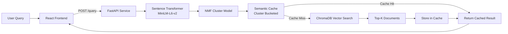
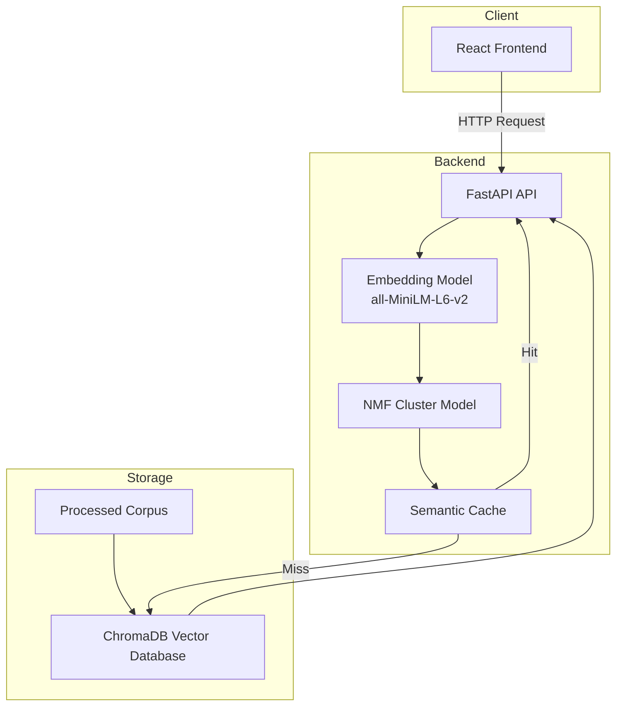
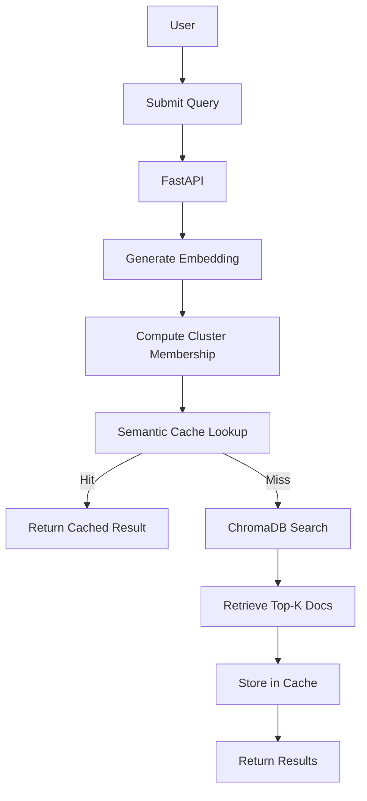

# 20 Newsgroups Semantic Search

A lightweight semantic search system over the [20 Newsgroups dataset](https://archive.ics.uci.edu/dataset/113/twenty+newsgroup) featuring **NMF fuzzy clustering**, **sentence-transformer embeddings**, and a **from-scratch cluster-bucketed semantic cache**.
The system indexes **19,898 cleaned documents** from the 20 Newsgroups dataset and exposes a semantic search API with cluster-aware caching.

Built as part of an AI engineering assignment.

---

## Architecture


---

## System Architecture


---
## Data Flow


---
## Query Flow

1. User sends query to FastAPI
2. Query is embedded using `all-MiniLM-L6-v2`
3. Query cluster membership computed via NMF
4. Semantic cache checked within relevant cluster buckets
5. If cache miss → vector similarity search in ChromaDB
6. Results returned and cached for future queries
---

## Design Decisions

### Why `all-MiniLM-L6-v2`?

| Model | Params | Dim | Speed (M-series) | Notes |
|---|---|---|---|---|
| **all-MiniLM-L6-v2** ✓ | 22M | 384 | ~2ms/doc | Trained on 1B+ pairs (Reddit, NLI, QA). Conversational training data matches newsgroup style |
| all-mpnet-base-v2 | 109M | 768 | ~10ms/doc | Better benchmarks but 5x slower, 2x larger index |
| text-embedding-ada-002 | — | 1536 | API call | Requires OpenAI key, adds latency, costs money |

**Key setting:** `normalize_embeddings=True` so cosine similarity = dot product everywhere.

### Why NMF Clustering (Not K-Means / LDA)?

The assignment requires a **distribution over clusters** per document (fuzzy/soft clustering):

- **NMF** factorizes the TF-IDF matrix `V ≈ W × H`. After L1-normalising `W`, each row is a valid probability distribution over clusters. Natively soft, no hack needed.
- **K-Means** produces hard labels. Soft K-Means assumes spherical geometry — unsuitable for TF-IDF space.
- **LDA** requires integer counts (incompatible with sublinear TF-IDF), slower variational inference, poor on short informal text.
- **HDBSCAN** is density-based and unreliable in high-dimensional TF-IDF space.

### Why TF-IDF Input (Not Embeddings) for NMF?

NMF on TF-IDF produces an **interpretable H matrix** — topic-term distributions that label clusters by their defining words. These clusters are used for **cache bucketing**, where topic-coherence matters more than embedding geometry.

### Why 23 Clusters (Not 20)?

Despite 20 newsgroup labels, several groups share nearly identical vocabulary (e.g., `comp.sys.mac.hardware` ≈ `comp.sys.ibm.pc.hardware`). An **elbow analysis** on NMF reconstruction error identified **23** as the point where adding components stops yielding meaningful reduction.

### Why Cluster-Bucketed Semantic Cache?

**The problem:** A naive cache does O(n) cosine comparisons per lookup. At 10k entries, the cache itself becomes the bottleneck.

**The solution:** Store entries in buckets keyed by dominant cluster. At lookup, search only the relevant bucket(s):

| Strategy | Comparisons (10k entries) |
|---|---|
| Naive flat scan | 10,000 |
| **23 buckets** | **~435** (23x faster) |

**Boundary expansion:** Queries near cluster boundaries (e.g., "gun legislation" between politics and firearms) trigger search across multiple buckets using the NMF membership distribution (threshold ≥ 20%).

### Similarity Threshold: 0.85

| Threshold | Behaviour | Trade-off |
|---|---|---|
| 0.95+ | Near-exact rephrase only | Very safe, low hit rate |
| **0.85** ✓ | Paraphrase-level match | Best precision/recall balance |
| 0.75 | Topic-level matching | Higher hit rate, risk of conflation |
| 0.60 | Cluster-level | Too aggressive, unrelated queries collide |

Validated via threshold sweep analysis in `scripts/05_explore_clusters.py`.

---

## Quick Start

### Prerequisites

- Python 3.10+
- Node.js 18+ & npm
- 4 GB RAM (sentence-transformer + ChromaDB)
- ~500 MB disk space (model weights, vector index, and processed corpus)

### Backend Setup

```bash
# Clone and enter the project
cd newsgroups_search

# Create virtual environment
python -m venv venv
source venv/bin/activate   # Windows: venv\Scripts\activate

# Install dependencies
pip install -r requirements.txt

# Copy env template (defaults work out of the box)
cp .env.example .env   # or use the existing .env
```

### Run the Data Pipeline

Execute scripts **in order** — each depends on the previous:

```bash
# 1. Download & extract dataset
python scripts/01_download_data.py

# 2. Clean & preprocess corpus
python scripts/02_preprocess.py

# 3. Initial embedding + indexing
# (runs without cluster assignments yet)
python scripts/03_embed_and_index.py

# 4. Fit NMF clustering model
python scripts/04_cluster.py

# 5. Re-run embedding + indexing
# (adds cluster memberships to metadata)
python scripts/03_embed_and_index.py

# 6. Explore cluster quality & threshold analysis
python scripts/05_explore_clusters.py
```
Note: `03_embed_and_index.py` is executed twice. The first run builds
the vector index, while the second run (after clustering) enriches
document metadata with cluster memberships.

### Start the API

```bash
uvicorn app.main:app --host 0.0.0.0 --port 8000
```

The API is now live at `http://localhost:8000` with interactive docs at `http://localhost:8000/docs`.

### Frontend Setup (React + Vite)

```bash
cd frontend

# Install dependencies
npm install

# Start dev server (port 3000, proxies /api/* → localhost:8000)
npm run dev
```

Open `http://localhost:3000` in your browser.

---

## API Reference

### `POST /query`

Semantic search with cache-first lookup.

**Request:**
```json
{
  "query": "How do space shuttles work?"
}
```

**Response:**
```json
{
  "query": "How do space shuttles work?",
  "cache_hit": false,
  "matched_query": null,
  "similarity_score": null,
  "result": "[1] similarity=0.6023 | newsgroup=sci.space | cluster=6\nNASA's space shuttle program...",
  "dominant_cluster": 6
}
```

On cache hit:
```json
{
  "query": "Tell me about the space shuttle",
  "cache_hit": true,
  "matched_query": "How do space shuttles work?",
  "similarity_score": 0.9134,
  "result": "[1] similarity=0.6023 | newsgroup=sci.space | cluster=6\n...",
  "dominant_cluster": 6
}
```

### `GET /cache/stats`

```json
{
  "total_entries": 12,
  "hit_count": 8,
  "miss_count": 15,
  "hit_rate": 0.3478
}
```

### `DELETE /cache`

Flushes all cached entries and resets statistics.

```json
{
  "message": "Cache flushed successfully.",
  "entries_cleared": 12
}
```

### `GET /health`

```json
{
  "status": "ok",
  "vector_store_count": 19898,
  "cache_entries": 12,
  "model": "all-MiniLM-L6-v2"
}
```

---

## Docker

```bash
# Build and run (data dir is volume-mounted for persistence)
docker-compose up --build

# Or run directly
docker build -t newsgroups-search .
docker run -p 8000:8000 -v ./data:/app/data newsgroups-search
```

> **Note:** The data pipeline (scripts 01–04) must be run **before** Docker, or inside the container with the data directory mounted. The Docker image bakes in the sentence-transformer model weights at build time for instant startup.

---

## Project Structure

```
newsgroups_search/
├── app/
│   ├── api/routes.py            # POST /query, GET /cache/stats, DELETE /cache, GET /health
│   ├── core/
│   │   ├── config.py            # Pydantic-settings (all tunables in .env)
│   │   ├── embedder.py          # Sentence-transformer wrapper, singleton
│   │   ├── vector_store.py      # ChromaDB wrapper with batch upsert
│   │   ├── clustering.py        # NMF fuzzy clusterer (fit/transform/save/load)
│   │   └── semantic_cache.py    # Cluster-bucketed cache, pure Python, thread-safe
│   ├── models/schemas.py        # Pydantic request/response models
│   ├── utils/preprocessing.py   # Text cleaning pipeline
│   └── main.py                  # FastAPI app with lifespan startup
├── frontend/                    # React + Vite SPA
│   ├── src/
│   │   ├── api.js               # API client (configurable base URL)
│   │   ├── App.jsx              # Root component
│   │   ├── components/
│   │   │   ├── SearchBar.jsx    # Query input + submit
│   │   │   ├── HealthBar.jsx    # API health indicators
│   │   │   ├── CacheBadge.jsx   # Cache hit/miss badge + similarity
│   │   │   ├── ResultCard.jsx   # Individual search result
│   │   │   ├── ResultsList.jsx  # Results container
│   │   │   └── StatsPanel.jsx   # Live cache stats + flush button
│   │   ├── index.css            # Global styles (dark glassmorphism)
│   │   └── main.jsx             # React entry point
│   ├── index.html               # HTML shell
│   ├── vite.config.js           # Dev proxy + build config
│   └── package.json             # Node dependencies
├── scripts/
│   ├── 01_download_data.py      # Dataset download & extraction
│   ├── 02_preprocess.py         # Cleaning, dedup, quality filtering
│   ├── 03_embed_and_index.py    # Embedding + ChromaDB indexing
│   ├── 04_cluster.py            # NMF elbow analysis + model fitting
│   └── 05_explore_clusters.py   # Threshold sweep, cache simulation, coherence
├── tests/                       # Pytest test suite
├── Dockerfile                   # Multi-stage build with baked model weights
├── docker-compose.yml           # One-command deployment
├── requirements.txt             # Pinned Python dependencies
└── .env.example                         # Configuration (all tunables)
```
Note: The `data/` directory is intentionally empty in the repository
(except for a `.gitkeep` placeholder). All embeddings,
cluster models, and vector indexes are generated by running the
pipeline scripts in the `scripts/` directory.
---

## Configuration

All settings are controlled via `.env` or environment variables:

| Variable | Default | Description |
|---|---|---|
| `EMBEDDING_MODEL` | `all-MiniLM-L6-v2` | Sentence-transformer model name |
| `N_CLUSTERS` | `23` | NMF component count |
| `CACHE_SIMILARITY_THRESHOLD` | `0.85` | Cosine similarity threshold for cache hits |
| `RETRIEVAL_TOP_K` | `5` | Number of results per query |
| `DATA_DIR` | `./data` | Root data directory |
| `CHROMA_PERSIST_DIR` | `./data/chroma_db` | ChromaDB storage path |
| `VITE_API_URL` | `/api` (proxied) | Frontend API base URL (for production builds) |

---

## License

This project was built as an assignment for Trademarkia.
